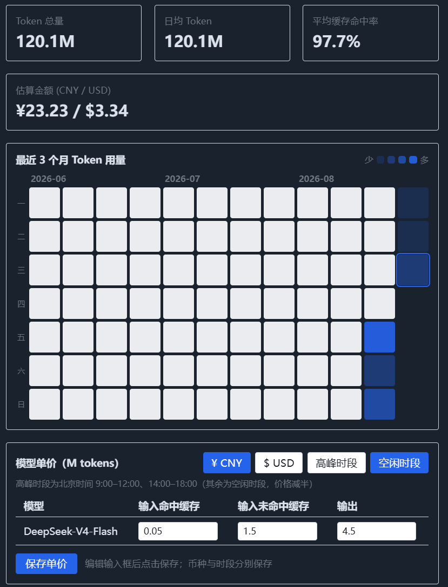
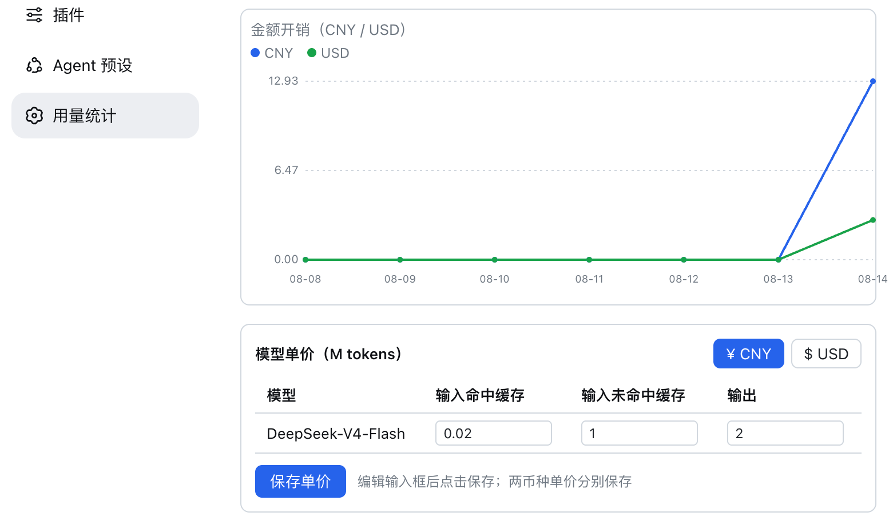

# dsh-token-usage

[English](README.md) | 中文

dsh（DeepSeek Harness）外部插件：在 Web 设置面板新增「用量统计」页，展示过去 7/15/30 天的
token 用量与估算金额折线图，以及当前已接入模型的单价表（M tokens），并支持在页面内直接
编辑两种货币（CNY / USD）下、高峰/空闲两个时段各自的模型单价。

数据来自历史会话日志中 `assistant/message` 事件携带的 `usage` 字段——插件是纯观察者，
不改动 agent-loop，也不向任何外部服务上报数据。

## 功能

- **设置 → 用量统计**：时间范围一键切换（7/15/30 天），token 用量折线图（总量 / 输入 / 输出 / 缓存命中 / 缓存写入 / 推理），金额折线图（CNY 与 USD 双系列），hover 显示具体数值。
- **汇总卡片**：Token 总量、日均 Token、平均缓存命中率、估算金额（CNY 与 USD 同时展示）。
- **模型单价表**：展示当前已接入模型（来自 `ctx.llm` 模型目录）在 **CNY 与 USD 两种货币**下的单价，每种货币按**高峰 / 空闲两档**分别展示与编辑；内置 `deepseek-v4-flash` 与 `deepseek-v4-pro` 的官方峰谷默认价。
- **单价编辑**：单价表内切换 CNY/USD 币种与高峰/空闲时段，内联修改价格后点「保存单价」写回配置，统计自动按新价刷新（无需重启）。
- **按时段精确计价**：每次调用的金额按**事件自身时间戳**落在哪个时段结算——北京时间高峰时段（9:00–12:00、14:00–18:00）的调用按高峰价，其余按空闲价（半价），无需手动取一档。
- **性能**：
  - 服务端按 session 日志文件 mtime 剪枝 + 有界并发读取（默认 8 路）+ 30s 响应缓存，实测 69 个 session 由 12.8s 降至约 1s（热缓存 <1ms）。
  - 客户端在页面激活时并行预取 7/15/30 天三档数据并做 30s 本地缓存，**切换日期范围即时渲染**（无 loading 闪烁、无额外请求）。

## 界面截图





## 安装

本插件直接安装进 DeepSeek Harness 的**原生 Web profile**（`web` 是随发行版交付的内置
profile，`dsh web` 即 `--profile web` 的硬编码别名）。装好后**无需指定任何 profile**，
在 Harness 检出目录直接 `pnpm dsh web` 启动即可加载本插件。

### npm 渠道（预构建，零权限）

```sh
dsh plugin --profile web add dsh-token-usage
```

### GitHub 直装（源码 + prepare 自构建，需放行一次）

```sh
dsh plugin --profile web add github:Tastelessor/dsh-token-usage#<commit-sha>
# 首次 add 失败后，把 pnpm 打印的包键加入 web profile 的 pnpm-workspace.yaml：
#   $DSH_HOME/profiles/web/pnpm-workspace.yaml
#   allowBuilds:
#     dsh-token-usage: true
# 然后重新 add
```

### 本地路径安装

```sh
dsh plugin --profile web add /path/to/dsh-token-usage
```

`dsh plugin add ./` 走 pnpm link，**不运行** prepare——先 `pnpm build` 再 add。

### 启动

```sh
pnpm dsh web        # 在 DeepSeek Harness 检出目录；web 是内置 profile，无需 --profile
```

## 配置（单价表）

在 web profile 的 `cordis.patch.yml`（`$DSH_HOME/profiles/web/cordis.patch.yml`，或
`--patch` overlay）覆盖；两种货币分别配置，每个模型条目为 `peak` / `offPeak` 两档，
缺省沿用内置默认价：

```yaml
- patch:
    - id: dsh-token-usage
      config:
        currency: CNY        # 首选币种：CNY（默认，¥）/ USD（$）
        models:
          deepseek-v4-flash:
            cny:             # 人民币单价（¥ / M tokens）
              peak:          # 北京时间 9:00–12:00、14:00–18:00
                inputPerM: 3.0         # 输入未命中缓存
                cacheReadPerM: 0.10    # 输入命中缓存
                outputPerM: 9.0       # 输出
                cacheWritePerM: 0      # 官方 v4 定价无缓存写入桶
              offPeak:       # 其余时段（高峰的一半）
                inputPerM: 1.5
                cacheReadPerM: 0.05
                outputPerM: 4.5
                cacheWritePerM: 0
            usd:             # 美元单价（$ / M tokens）
              peak:
                inputPerM: 0.44
                cacheReadPerM: 0.014
                outputPerM: 1.32
                cacheWritePerM: 0
              offPeak:
                inputPerM: 0.22
                cacheReadPerM: 0.007
                outputPerM: 0.66
                cacheWritePerM: 0
```

> 旧的平面写法（只有 `inputPerM` / `cacheReadPerM` / `outputPerM` / `cacheWritePerM`
> 四个字段，2026-08-17 之前的配置）仍然可解析，等价于「全天同价」（两档相同）。
>
> 内置默认价（`src/host/config.ts`）即下表官方价；页面内「保存单价」等价于写入上述
> `models.<id>.cny|usd`（两档一并保存），无需手改配置。

### 官方价格（2026-08-18 核对自 api-docs.deepseek.com）

DeepSeek 自 2026-08-17 起按**峰谷计价**：高峰时段为北京时间 9:00–12:00、14:00–18:00，
空闲时段价格为高峰的一半（¥ / $ 每百万 tokens，缓存命中 / 未命中 / 输出）：

| 模型 | 空闲时段 CNY | 高峰时段 CNY | 空闲时段 USD | 高峰时段 USD |
|---|---|---|---|---|
| deepseek-v4-flash | 0.05 / 1.5 / 4.5 | 0.10 / 3.0 / 9.0 | $0.007 / $0.22 / $0.66 | $0.014 / $0.44 / $1.32 |
| deepseek-v4-pro | 0.15 / 4.5 / 13.5 | 0.30 / 9.0 / 27.0 | $0.022 / $0.66 / $1.98 | $0.044 / $1.32 / $3.96 |

> 金额估算会把每次用量的**事件时间戳**按上述窗口（北京时间 UTC+8，与宿主本地时区无关）
> 自动落到对应档位：高峰时段的调用按高峰价、空闲时段的调用按半价，各自精确入账。

> 实现说明：dsh 的 Web 配置 API（`settings.mutate`）只对宿主内置命名空间白名单开放，
> 外部插件命名空间会被拒（`settings-not-exposed`），因此价格写回走插件自有的
> `POST /dsh-token-usage/prices` 路由，由 node 半在进程内调用 `ctx.settings` 落盘
> （与手改配置完全等价）。

## 已知限制 / 免责声明

- 金额为**估算值**（内置单价表 × 实际 token 四桶），非 provider 账单；单价以官方最新价为准，请自行核对。
- 金额同时按 CNY 与 USD 估算并同屏展示；两种货币的单价独立配置。
- 30s 响应缓存意味着**峰谷窗口切换瞬间**（北京时间 9:00 / 12:00 / 14:00 / 18:00）附近最多延迟 30s 生效。
- `reasoningTokens` 是输出子类，不会重复计入金额。
- 两种货币都未配置单价的模型：token 照常统计，金额不计入，页面提示「未配置」。
- 聚合在 node 半内存完成，仅 30s 短时缓存；数据量极大时首次加载可能仍需数秒（此后切换范围由客户端预取缓存即时渲染）。

## 开发

```sh
pnpm install     # 安装依赖（peer 依赖由 dsh profile 在运行时提供）
pnpm test        # vitest，72 个用例
pnpm typecheck   # tsc --noEmit
pnpm build       # tsdown 构建到 lib/
```

## License

[MIT](LICENSE)
